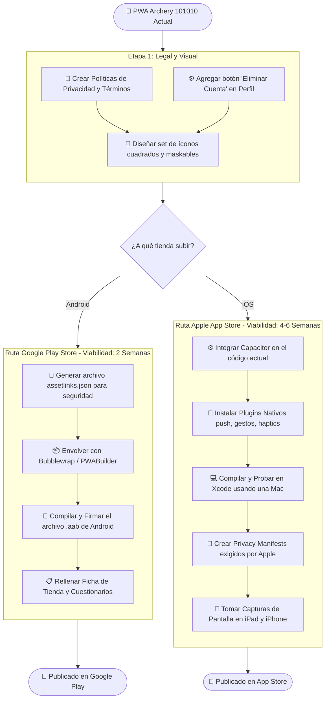
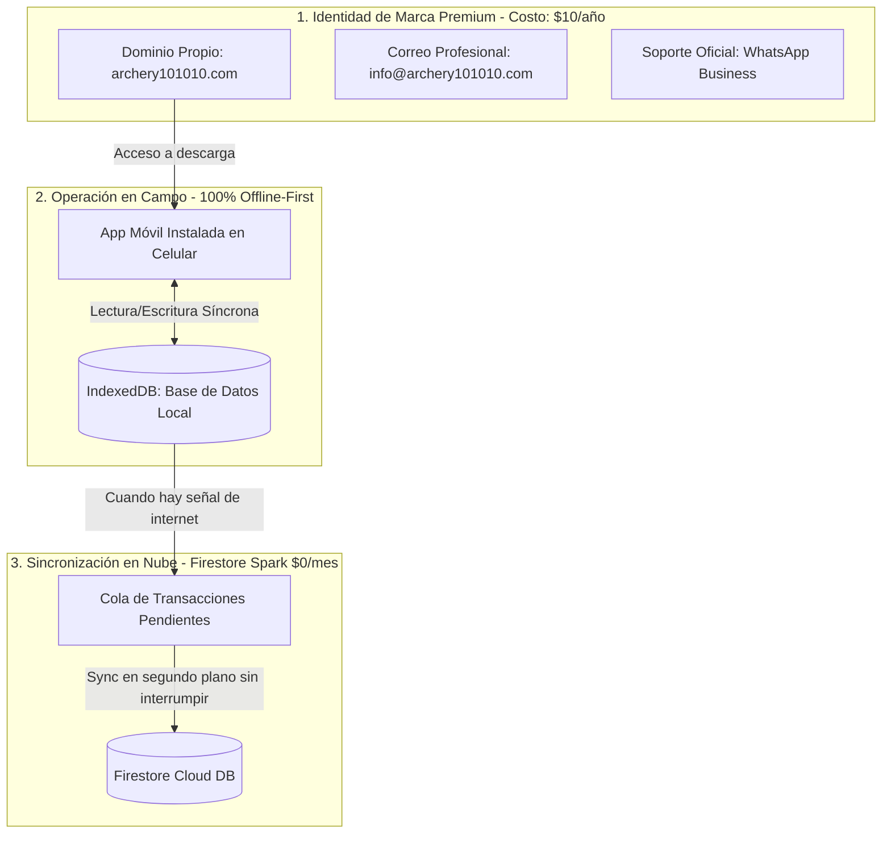

# 🎯 GUÍA DE NEGOCIO: Procedimiento de Configuración y Costo Cero (Archery 101010)

Esta guía detalla el **procedimiento operativo paso a paso** para estructurar la identidad corporativa premium de *Archery 101010* y configurar los **servidores gratuitos con tu propio nombre de dominio**, iniciando desde cero y sin gastos mensuales.

---

## 🗺️ 1. FLUJOGRAMA DE RUTA: Lanzamiento en Tiendas

Este mapa de ruta divide el trabajo en tres etapas sencillas: lo legal y visual que es obligatorio para ambas tiendas, el camino rápido para **Google Play** (envoltura web) y el camino robusto para **Apple App Store** (empaquetado nativo).

---

## 📋 2. PROCEDIMIENTO PASO A PASO: Estructurar Identidad y Servidores Gratis

Este es el procedimiento de negocio para entrelazar las herramientas gratuitas con tu nombre de dominio propio (`archery101010.com`):

### 🌐 Paso 1: Adquirir el Nombre de la Empresa (El único gasto)
1. Comprar el dominio **`archery101010.com`** en un registrador como Cloudflare o Namecheap.
2. **Costo:** ~$10 - $12 USD al año.
3. Este dominio es el "ancla" que validará toda tu marca y tus correos.

### 📧 Paso 2: Crear Correos Corporativos Gratis
1. Registrarse en **Zoho Mail (Free Plan)** vinculando tu dominio.
2. Configurar los registros DNS en el panel del dominio (copiar los códigos MX y TXT que te da Zoho).
3. Crear hasta 5 cuentas oficiales gratis (ej: `info@archery101010.com`, `admin@archery101010.com`).
4. **Costo:** $0.00 USD. Proyecta imagen de empresa sólida sin pagar los $6 USD mensuales por usuario de Google Workspace.

### 💬 Paso 3: Activar Soporte y Ventas Premium
1. Descargar la aplicación **WhatsApp Business** en un celular de la empresa.
2. Completar el perfil comercial: colocar el logo oficial, vincular la web `archery101010.com`, el correo `info@archery101010.com` y configurar respuestas automáticas.
3. **Costo:** $0.00 USD. Atiende de forma automatizada y profesional a tus usuarios.

### 🚀 Paso 4: Enlazar los Servidores Gratuitos con tu Dominio
1. Crear un proyecto en **Firebase Console** (Spark Plan gratuito).
2. Entrar a la sección de **Hosting** y hacer clic en *"Conectar Dominio Personalizado"*.
3. Escribir `archery101010.com`. Firebase te dará 2 direcciones IP.
4. Ir al panel de tu dominio (Cloudflare) y crear dos registros tipo `A` que apunten a esas IPs.
5. **Resultado:** Tu página web y aplicación se cargarán automáticamente desde la infraestructura mundial de Google bajo tu propio nombre (`https://archery101010.com`).
6. **Costo:** $0.00 USD. Incluye certificado SSL de seguridad gratuito.

### ⚡ Paso 5: Optimización de Base de Datos para Cero Costo Mensual
1. Modificar las consultas de la app en `realtimeSync.ts` para que utilicen filtros `where("clubId", "==", user.clubId)`.
2. Habilitar la base de datos local en el celular (`enableIndexedDbPersistence`).
3. **Resultado:** Al abrir la app, los datos se leen de la memoria interna del teléfono. Solo se descarga lo nuevo.
4. **Costo:** $0.00 USD de base de datos Firestore, ya que el consumo diario se mantiene por debajo de las 50,000 lecturas gratuitas del Spark Plan.

---

## 🔄 3. ECOSISTEMA DE NEGOCIO: Imagen Premium e Integración Offline-First

El modelo de negocio de *Archery 101010* se sostiene sobre la interacción armonizada de la marca y la base de datos local:

---

## 🛠️ 4. RESUMEN DE LA SUITE "COSTO CERO"

| Servicio | Proveedor Recomendado | Costo Mensual | Costo Anual | Propósito Corporativo / Profesional |
|---|---|:---:|:---:|---|
| **Dominio Propio** | Namecheap o Cloudflare | **$0.00** | **~$10 - $12 USD** | Comprar `archery101010.com` (Único costo obligatorio). |
| **Hosting PWA** | Firebase Hosting | **$0.00** | **$0.00** | Aloja el código web. **Enlazar un dominio propio a Firebase es 100% GRATIS** e incluye certificado SSL (candado de seguridad). |
| **Seguridad y CDN** | Cloudflare (Free Plan) | **$0.00** | **$0.00** | Acelera la carga, protege contra ataques y administra el dominio de forma profesional. |
| **Email Corporativo** | Zoho Mail (Free Plan) o ImprovMX | **$0.00** | **$0.00** | Permite tener correos profesionales como `info@archery101010.com` redireccionados a un Gmail gratis sin pagar Google Workspace ($6/usuario). |
| **Base de Datos** | Firebase Spark Plan (Optimizado) | **$0.00** | **$0.00** | Soporta hasta 50k lecturas al día gratis si optimizamos la sincronización. |
| **Soporte y Ventas** | WhatsApp Business App | **$0.00** | **$0.00** | Cuenta de empresa oficial utilizando una línea telefónica móvil normal (sin usar APIs de pago). |
| **Métricas y Errores** | Google Analytics 4 + Sentry | **$0.00** | **$0.00** | Mide usuarios activos y detecta caídas de la app en producción sin pagar licencias. |

---

## 💰 5. DESGLOSE DE COSTOS DE TIENDAS Y LICENCIAS

Al momento en que decidas pasar del formato PWA web al formato de tiendas de aplicaciones nativas, se deben contemplar los siguientes costos directos:

| Categoría | Concepto | Costo | Frecuencia | Tipo de Costo |
|---|---|---|---|---|
| **Google Play** | Licencia de Google Play Console | **$25 USD** | Pago Único | Obligatorio |
| **Apple App Store** | Apple Developer Program | **$99 USD** | Anual | Obligatorio |
| **Legal** | Redacción y generación de políticas | **$0 USD** | Free Generators | Recomendado |
| **Assets de Tienda** | Diseños publicitarios y mockups | **$0 USD** | Uso de Canva Free | Opcional |
| **Pasarela de Pago** | Comisión por In-App Purchases (Suscripciones) | **15%** | Por Transacción | Apple/Google Fee* |
| **Gestión de Pagos** | Configuración técnica de compras (RevenueCat) | **$0 USD** | Mensual (Gratis <$10k/mo) | Técnico |

---

## 📊 6. PROYECCIÓN FINANCIERA: Crecimiento de 1,000 Usuarios al Mes

### A. Costo de Servidores (Firebase Spark vs. Blaze Plan)
*Nota: El Plan Spark (Gratuito) cubre las primeras 50,000 lecturas al día. Al superarlas, se activa el Plan Blaze (Pago).*

| Mes | Usuarios Registrados | Usuarios Activos/Día (DAU) | Costo Firebase Actual (Sin Optimizar) | Costo Firebase Optimizado (Recomendado) |
|:---:|:---:|:---:|:---:|:---:|
| **Mes 1** | 1,000 | 250 | **$19 USD** | **$0 USD** (Gratis) |
| **Mes 3** | 3,000 | 750 | **$170 USD** | **$3 USD** |
| **Mes 6** | 6,000 | 1,500 | **$851 USD** | **$7 USD** |
| **Mes 9** | 9,000 | 2,250 | **$2,280 USD** | **$11 USD** |
| **Mes 12** | 12,000 | 3,000 | **$4,134 USD** | **$16 USD** |

### B. Proyección de Costo Anual Acumulado (Primer Año desde Cero)
- **Ruta PWA Web con Dominio Propio (Sin tiendas y optimizada):** **~$12 USD / año** (Costo del dominio únicamente).
- **Ruta Tiendas Móviles Completas (Google Play + App Store + Firebase Optimizado):** **~$194 USD / año** ($124 licencias + $70 servidores).
- **Ruta Sin Optimizar Servidores (Inviable):** **~$18,124 USD / año**.

---

## 📈 7. MODELO DE NEGOCIO: Retorno de Inversión (PRO Tier)

Si proyectamos un escenario de **12,000 usuarios en el Mes 12** y una tasa de conversión conservadora del **5% a la suscripción PRO ($4.99/mes)**, las finanzas netas se verían así:

* **Suscripciones Activas (5% de 12k):** 600 usuarios
* **Ingreso Bruto Mensual:** **$2,994 USD** (600 × $4.99)
* **Comisión 15% Apple/Google:** **-$449.10 USD**
* **Infraestructura Firebase (Optimizado):** **-$16.00 USD / mes**
* **Licencia Apple Developer prorrateada:** **-$8.25 USD / mes**
* **INGRESO NETO MENSUAL:** **$2,520.65 USD**
* **Margen de Ganancia Neto:** **84.2%**
